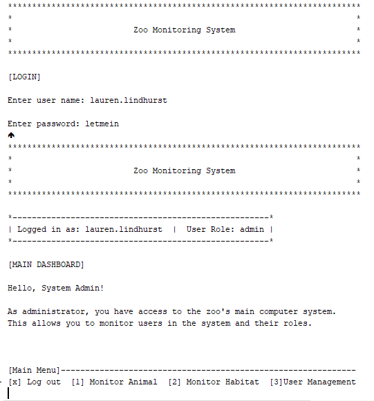

  

---

### Zoo Monitoring System IT145 Foundations in Application Development Algorithms And Data Structures Artifact

---

    

---

This project represents an authentic demonstration of competency because of its involves application of real-world Java programming. This project is made of two parts. Part 1 is an Authentication System, which only allows access to the application once authenticated, allowing only the appropriate information to the be read by the appropriate people. Part 2 is a Monitoring System that displays animal, habitat, and user information according to your designated authenticated role.

#### Documents
<a href="https://github.com/lo-rose/eportfolio/blob/main/enhancement/IT145/rubric145.pdf" target="_blank">Guidelines and Rubric for IT-145 Final Project</a>

    
    
<em>Figure 1 - IT-145 Final Project</em>

---

Artifact enhancement files repository at [IT145 Foundations in Application Development](https://github.com/lo-rose/ePortfolio/main/enhancement/IT145 "Zoo Monitoring System - Repository")

---

    <a href="#">
        <button style="font-size: 10px; font-weight: 500; background: #BF40BF; color: #ffffff; border-radius: 50px; border-style: solid; border-color: #00000; padding: 5px 5px;">Back to Top &#8593;</button>
    </a>

