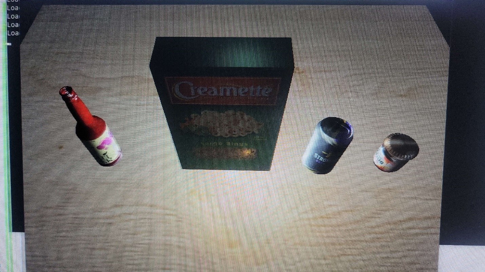
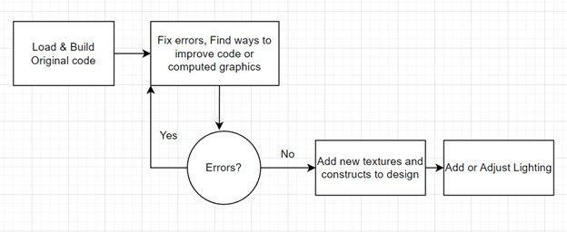
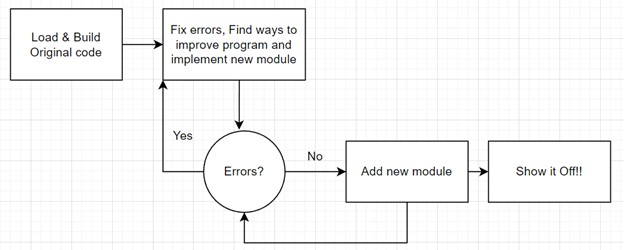
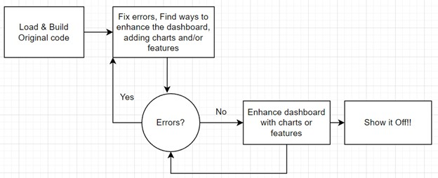

### Refinement Plan
---

    

---
<a href="https://github.com/lo-rose/ePortfolio/blob/main/CS499/portfolioselection.docx" target="_blank">Portfolio Selection and Refinement Plan: Document</a>

This is my plan to fulfill the requirements for my ePortfolio by using previous coursework I have completed in the past and looking for ways to enhance it. I will demonstrate my skills in the three categories for Computer Science: Software Design/Engineering, Algorithms and Data Structures, and Databases.

    
    
<em>Figure 1 - CS-330 Original Final Project</em>

    

#### Category One: Software Design and Engineering

#### Artifact: OpenGL 3D Animation

#### Course: CS-330 Computational Graphics and Visualization

#### Enhancement Plan:

When I think back through my coursework, one of courses that I felt to be my biggest accomplishment was CS-330: Computational Graphics and Visualization. I used OpenGL libraries to design a 3D model from items I took a photograph of on my kitchen table.  I think my project in this course best displays my understanding of C++ and software design/engineering. The artifact I chose for the Software Design/Engineering category is my OpenGL 3D Animation. My plan to enhance this project by adding an additional 3D Object.

#### Skills:

I feel my enhancement will showcase my ability using API libraries and computer graphics development best practices. I will be illustrating my skills to create three-dimensional objects while employing best practices in formatting, commenting, and functional logic that produces reliable computer programs.

#### Course Outcomes:

* [CS-499-03] Design and evaluate computing solutions that solve a given problem using algorithmic principles and computer science practices and standards appropriate to its solution while managing the trade-offs involved in design choices.
* 
* [CS-499-04] Demonstrate an ability to use well-founded and innovative techniques, skills, and tools in computing practices for the purpose of implementing computer solutions that deliver value and accomplish industry-specific goals (software engineering/design/database)
	
 
#### Flowchart and Pseudocode:

    
    
<em>CS-330 Flowchart</em>

    

1.	Load and Build Original Code
1.	Fix Errors
1.	Design new object in Blender
1.	Import new object
1.	Apply texture to new object
1.	Compile and fix errors
1.	Ensure code applies best practices
 
#### Category Two: Algorithm and Data Structures

#### Artifact: Zoo Authentication and Monitoring System Program

#### Course: IT-145 Foundation in Application Development

#### Enhancement Plan:

The artifact I will use to demonstrate my skills in Algorithms and Data Structures is the Zoo Monitoring System Program. The program is from the IT-145 Foundation in Application Development course and is produced in JAVA. I selected this artifact because it involves a good understanding of algorithms and data structures to authenticate and authorize a user to access data in the system. I would like to enhance this program by completing the second option from the original coursework. The coursework originally required you to choose between the authentication system or the monitoring system and build it. I would like to build the monitoring system, so that after my original authentication system has been used and a user has successfully logged in, they can then access modules based on their user privilege to monitor an animal, monitor a habitat, or exit.
    
#### Skills:

The enhancement plan I propose will demonstrate my understanding of algorithms logic and relation with data structures to develop object-oriented programming elements effectively. It will showcase the skill and concepts of using JAVA, implementing appropriate variables, operators, methods, and class as they are used for developing successful programs. It will also display appropriate syntax and conventions in terms of their best practices and their use in programming.
    
#### Course Outcomes:

* [CS-499-01] Employ strategies for building collaborative environments that enable diverse audiences to support organizational decision-making in the field of computer science. 
* [CS-499-02] Design, develop, and deliver professional-quality oral, written, and visual communications that are coherent, technically sound, and appropriately adapted to specific audiences and contexts.
* [CS-499-05] Develop a security mindset that anticipates adversarial exploits in software architecture and designs to expose potential vulnerabilities, mitigate design flaws, and ensure privacy and enhanced security of data and resources.
* 
#### Flowchart and Pseudocode:

    
    
<em>IT-145 Flowchart</em>

    

1.	Load and compile original code
1.	Check for Errors
1.	Use appropriate control structures for program logic to implement module after authentication
    a.	Authenticate user
        
    b.	Display options valid to user

1.	Design Monitoring System
    a.	User choses between monitoring animal, habitat, or exit
    b.	Displays list of animals and habitats based on previous selection
    c.	Display monitoring information 
 
 
#### Category Three: Databases

#### Artifact: Grazioso Salvare Animal Shelter Search Dashboard

#### Course: CS-340 Client Server Development

#### Enhancement Plan:

The artifact I will use to demonstrate my skills in Databases is the Grazioso Salvare Animal Shelter Search Dashboard. This project is from course CS-340: Client/Server Development.  This web application is used with an existing database from animal shelters to categorize different animals (cats and dogs) by various and multiple factors. The application is developed in Python with Dash framework and with MongoDB, using PyMongo. I feel this project best displays my knowledge with databases and how to utilize them. This project was originally developed on the Apporto platform, a virtual Linux system for student access. I would like to enhance this project by recreating it and using it on my machine running Windows Operating System.

#### Skills:  

This enhancement plan will demonstrate my knowledge of Python language and the integration of MongoDB database through the use of the Python driver PyMongo and use of Python framework Dash. It illustrates my ability to apply database system concepts and principles in the development of a client/server application.
        
#### Course Outcomes:

* [CS-499-02] Design, develop, and deliver professional-quality oral, written, and visual communications that are coherent, technically sound, and appropriately adapted to specific audiences and contexts.

* [CS-499-03] Design and evaluate computing solutions that solve a given problem using algorithmic principles and computer science practices and standards appropriate to its solution while managing the trade-offs involved in design choices. 

* [CS-499-04] Demonstrate an ability to use well-founded and innovative techniques, skills, and tools in computing practices to implement computer solutions that deliver value and accomplish industry-specific goals.
 
#### Flowchart and Pseudocode:

    
    
<em>CS-340 Flowchart</em>

    

1.	Recreate the application on local machine using Windows OS
1.	Revise the README Documentation to implement the dashboard on a different operating system.
1.	Ensure professional quality written and visual communication appropriately adapted to the audience and context. 
 
#### ePortfolio Overall

Through my code review, I plan to demonstrate my skills and knowledge that I have gained throughout my coursework. It will demonstrate my ability to view code and objectively analyze it, correcting both logical and syntax errors and improving it where needed. It will also display my ability to creatively and logically design solutions that exceed industry standards, while using best practices and develop readable, functional code.
        
With my knowledge of the narratives of the category areas of software design and engineering, algorithms and data structures, and databases I will demonstrate the skills I have acquired, and the knowledge I have retained, to apply appropriate data structures, using functional algorithms, effectively using databases to organize data, and employ the methods of best coding and security practices and techniques.

My professional self-assessment will illustrate my desire and motivation to excel in the computer science program and field. Through hard work and pushing myself I have learned so much, exceled in every way I could. I have made it on the President’s List several times and I am soon graduating with honors. I will also address my strengths in several different computer languages, ability to debug and troubleshoot, finding a solution to every problem while implementing industry’s best standards and good practices. 

---
### Code Review Videos Links
---

Code Review Part 1

<iframe src="https://www.youtube.com/embed/MPRjPozSNDI" 
        title="Code Review Part 1" frameborder="0" allowfullscreen
        allow="accelerometer; autoplay; clipboard-write; encrypted-media; gyroscope; picture-in-picture" 
        style="position: absolute; width: 100%; height: 100%;">
</iframe>

Code Review Part 2

<iframe src="https://www.youtube.com/embed/bVXsJAzRMOo" 
        title="Code Review Part 2" frameborder="0" allowfullscreen
        allow="accelerometer; autoplay; clipboard-write; encrypted-media; gyroscope; picture-in-picture" 
        style="position: absolute; width: 100%; height: 100%;">
</iframe>

