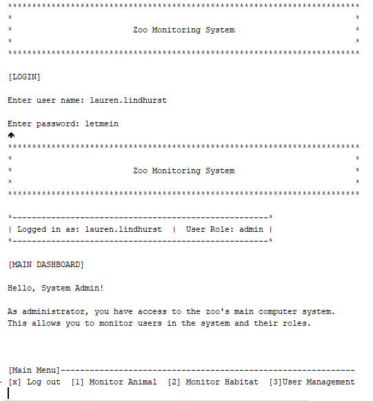

&nbsp;&nbsp;&nbsp;&nbsp;

## Welcome

My ePortfolio reflects my knowledge and skills gained through the years of studying Computer Science through the program at Southern New Hampshire University. It displays my triumph and continued success in the program through my work and through achieved awards such as President List's and honor roll. My ePortfolio was carefully designed in a professional manner, showing both visual and technical written aspects of my chosen artifacts, displaying my capacities and abilities in a logically, technically sound, and professional manner with a specific technical audience and context in mind.

### Table of Contents

* &nbsp;[Professional Self-Assessment](#self-assessment "Professional Self-Assessment") 
&nbsp;&nbsp;&nbsp;&nbsp;[_Course Specifics and Portfolio Selections_](#course-specifics-and-portfolio-considerations "Course Specifics and Portfolio Considerations") 
&nbsp;&nbsp;&nbsp;&nbsp;[_Looking to the Future_](#looking-to-the-future "Looking to the Future") 
* &nbsp;[Refinement Plan and Code Review](#codereview "Refinement Plan and Code Review") 
&nbsp;&nbsp;&nbsp;&nbsp;[_Code Review_](#code-review-videos "Artifacts Code Review Videos Link") 
* &nbsp;[Software Design and Engineering](#softwaredesign "Software Design and Engineering") 
&nbsp;&nbsp;&nbsp;&nbsp;[_Artifact One: Software Design and Engineering_](#software-design-and-engineering-artifact "Artifact for Software Design and Engineering") 
* &nbsp;[Algorithms and Data Structure](#algorithms "Algorithms and Data Structure") 
&nbsp;&nbsp;&nbsp;&nbsp;[_Artifact Two: Algorithms and Data Structure_](#algorithms-and-data-structures-artifact "Artifact for Algorithms and Data Structure") 
* &nbsp;[Databases](#databases "Databases") 
&nbsp;&nbsp;&nbsp;&nbsp;[_Artifact Three: Databases_](#databases-artifact "Artifact for Databases")  

---------

### Showcasing my Strengths

The creation and maintenance of an ePortfolio has many benefits, including visually demonstrating your value and skills to potential employers. It has allowed me to organize and reflect on what I have learned throughout my program at Southern New Hampshire University. It allows me to visually display my strengths and set clear goals of what I want to achieve, helping me to become more desirable to potential employers. My ePortfolio displays not only key pieces of my work throughout the program but also my many achievements of honor roll and President’s list for 4 years. The content, including my chosen artifacts, showcased in my ePortfolio displays my growth in the key categories of Software Design and Engineering, Algorithms and Data Structures, and Databases.

My ePortfolio demonstrates the knowledge and skills I have successfully gained and strengthened during my studies in the Computer Science program. I display high quality professionally created visual and written communications that display my capabilities and are designed with a specific context and audience in mind. 

I have studied Computer Science at SNHU for 4 years. I joined the program to improve my skills and achieve my goals. I am originally a self-taught programmer, who began learning a few languages at the age of 12. I really enjoy engineering and figuring out how things tick. I designed several websites through geo-cities domains and developed programs in C++ and Visual Basic and Java to start. I have always had a passion for technology and work hard to strive in everything I set my mind to. Achieving Summa Cum Laude and being on the President’s List each year at SNHU shows my hard work has paid off at Southern New Hampshire University. 

During the completion of my program, I have learned an immeasurable number of skills and knowledge. I have approved my way of thinking logically and my attention to detail. Being well versed in best practices and having a security mindset, I develop my code in an organized and thought out manner. I develop my code in simple blocks, testing as I go ensuring my program works as intended and has no vulnerabilities. This helps to maintain control in the development process as the program becomes large and more complex. I continue to think with a analytic and defensive mindset to ensure I produce the best code I can.

Applying best practices and standards to  all of my work helps me to develop well formatted and reusable code that is easy to understand. I ensure that my code is well documented, leaving nothing up to interpretation. Implementing code reviews and applying security standards as well shows my attention to detail. Implementing code reviews allows me to analyze my code or my peer’s code and identify vulnerabilities or errors that may have been missed during the development process.

I have learned and utilized the Software Development Lifecycle (SDLC) in many projects, including large-scale projects as part of a team and as an individual. There are many factors that go into planning a large project and coordinating with team members. Understanding the client’s needs as part of the SDLC means taking those requirements and implementing them into a flowchart, pseudocode, or Alpha prototype (Game Development) that results in a Final Prototype or Program. For example, in GAM-305 I worked as the Team Lead and Art on a 5 person team and we used the SDLC for Alpha prototype, Beta prototype, and the Final Code release. We utilized both black box and white box testing through each phase. We collaborated through discord, using version control with Git and Bitbucket. 

    
    
<em>Figure 1 - GAM-305 Project: Virus Hunter</em>

I developed a Testing and Implementation Plan with a Bug Log in an Excel spreadsheet for us to stay organized: <a href="https://snhu-my.sharepoint.com/:x:/r/personal/lauren_lindhurst_snhu_edu/Documents/Gam305-TestPlanDocument.xlsx?d=w19665317088542769be89672e00aea2e&csf=1&web=1&e=10Eyvn" target="_blank">Gam305-TestPlanDocument.xlsx</a>. We also utilized the Bitbucket’s wiki feature throughout the process: <a href="https://bitbucket.org/LaurenRose/gam-305_project/wiki/Home" target="_blank">GAM-305 Project's Wiki</a>. This team project was an amazing experience to work remotely, collaborating with like minded individuals to meet the requirements of the Game Design Document and produce a successful game, superseding the expectations of the client (stakeholders). This not only increased my communication skills, but also improved my creativity and time management abilities.

    
    
<em>Figure 2 - GAM-305 Project: Virus Hunter - Gameplay</em>

Throughout the program, I learned and improved many valuable skills that make me an asset to potential employers and allowing me to strive in my future endeavors. All of these skills below will allow me to be the best in whatever I put my mind to. These skills will allow me to set goals and succeed further than I ever have.

| **Hard Skills** | **Soft Skills** |
|:-----------:|:-----------:|
| Computer Hardware | Organized |
| Data Analysis | Attention to Detail |
| Data Visualization | Critical Thinking |
| Programming | Problem Solving |
| Software Development | Collaboration |
| Game Design & Development | Effective Communication |
| Technical Writing| Writing |
| Security Mindset | Quick Learner |
| Mobile Development | Adaptability |
| Web Development | Mentoring |
| Virtual Environment Creation | Leadership|
| HTML/CSS/JS/Markdown| Customer Service|  
| JAVA| Interpersonal|
|UE4 & UE5| Time Management|
|Python | Goal-Oriented|
| C++ | Proactive|
| Databases| 
| SQL|
|MySQL|  
|MongoDB|  

#### Course Specifics and Portfolio Considerations

In each course throughout the Computer Science program, I have acquired the knowledge and skills necessary for me to excel in any job in the related field. While I was already experienced in the field prior to my coursework, each course had a substantial impact on me and my knowledgebase. I not only strengthened my current skills but learned many new skills and specifics to security and coding best practices/standards. Ultimately, I am now able to incorporate what I have learned and improved on into my selected and non-selected artifacts, where all of my skills learned from the courses are demonstrated and showcased. 

* CS-200: Computer Science’s Role in the Industry introduced me to the principles of hardware, software, computation, and algorithm development. I learned skills are data types, variables, control structures, logical expressions, and arrays.

* CS-210: Programming Languages strengthened my knowledge on the development of functional programs that comply with industry standards, regulations, and best practices using various programming languages. I learned and focused on the importance of developing code that is not only functional, but also secure, efficient, and professional.

* CS-250: Software Development Lifecycle taught me about the stages of the Software Development Lifecycle (SDLC) through the lens of developers and testers to examine the characteristics, documentation, and purpose of each stage. While applying SDLC stages within an agile development environment during the course, I learned the principles and best practices used to develop high quality software while also assessing the impact of communication, documentation, and ethics on the SDLC.

* CS-260: Data Structures and Algorithms taught me to develop code using non-coding development methodologies in algorithmic design and problem solving. I learned to use algorithmic designs to evaluate complex data structures to aid in problem solving.

* CS-320: Software Testing, Automation, and Quality Assurance allowed me to apply software engineering testing strategies.

* CS-310: Collaboration and Team Project taught me how to collaborate on a software project. I learn to apply appropriate change control and versioning practices. I used technologies for supporting collaboration on a project in a distributed workforce with remote contributors.

* CS-330: Computational Graphics and Visualization is the course where my first chosen artifact was developed. I learned to create realistic, interactive three-dimensional objects through the use of application programming interface (API) libraries and best practices. I learned to develop fully formed graphic applications that met project requirements.

* CS-340: Client/Server Development is the course where my last chosen artifact was created. I learned how to apply database system concepts and principles to develop client/server applications that interface client-side code with databases.

* IT-201: Computer Platform Technologies introduced me to the hardware and software technology background for information technology personnel. I learned hardware topics such as CPU architecture, memory, registers, addressing modes, busses, instruction sets and a variety of input/output devices. Software topics I learned included operating system modules, process management, as well as memory and file system management. Additionally, I learned about basic network components and multi-user operating systems.

* IT-145: Foundation in Application Development is the course where I chose my second artifact. In this course I used programming as a problem-solving technique in business and engineering applications. While writing computer code in a logical, structured, and organized manner, I learned to incorporate key concepts of object orientation into my programming. I also learned to write, review, and document interactive applications and work with Software Development Kits and Integrated Development Environment tools.

* IT-255: Intro to Linux Operating Systems introduced me to the major components of the Linux operating system and the basics of the Linux command line. I worked with files and directories, archive and compressed files, and searched and extracted data from files using pipes and redirection. I also learned how to package Linux commands from within a script.

* IT-315: Object Oriented Analysis and Design taught me software systems engineering principles combining object-oriented design principles and methods augmented by computer assisted engineering (CASE) technology. I learned and used the unified modeling language (UML) and through the vehicle of a student group project, was able to apply all elements to the system development life cycle. I was required to submit a comprehensive project report and a PowerPoint presentation, as well as participate in a specialized systems development computer lab.

* IT-365: Operating Environments taught me about operating environments used in today’s business computing environments, including enterprise level systems down to mobile devices. I gained an understanding of the components in an operating system and how they interact with each other and with system hardware and application software. I explored the importance of writing programs that take full advantage of operating support.

* DAT-220: Fundamentals of Data Mining taught me about data analytics and how a large portion focuses on identifying meaningful patterns in data. Using a case studies approach, I learned to examine effective strategies that blend both hypothesis testing and data driven discovery methods to identify meaningful data patterns and apply that knowledge to common business problems. I learned specifically on data-mining tasks such as classification, clustering, and sequential pattern discovery.

* DAD-220: Introduction to Structured Database Environments taught me to create structured database environments that incorporate basic processing functionality and allowed for data management, data manipulation, and data analysis. I also learned to construct and analyze queries to address data requirements.
* GAM-207: Information Technology and Digital Games introduced me to game genres and platforms, interface design, game implementation, artificial intelligence, business economics of the game industry, game marketing and design, e-collaboration, and e-commerce. I learned how to use software packages to design and implement digital game and how to use the internet to market and distribute digital games. I developed a project that culminated in the conception, design, and prototype of an original digital game. 
* GAM-303: Design of Virtual Game Environments strengthened my knowledge of the fundamental ideas behind the design of electronic games as virtual environments. I learned about relevant formal fields such as systems theory, cybernetics, and game theory. I developed my skills in interactive design, interface design, information design, and human-computer interaction. I specifically focused on how virtual game environments function to create experiences, including rule design, play mechanics, game balancing, social game interaction, and the integration of visual, audio, tactile, and textual elements into the total virtual game environment experience. I also learned about game documentation and play testing.

* GAM-305: Digital Game Development strengthened my knowledge of game development using programming languages and various game editors. I acquired the fundamental understanding of the Windows API, the use of sprites, animation, and audio in an integrated game environment. I also worked on a team and learned to use technologies to e-collaborate and utilized tools to apply appropriate change control and versioning practices. We implemented the SDLC methodologies for all three releases of our original digital game.

In CS-250 Software Development Lifecycle, CS-260 Data Structures and Algorithms, and IT-145 Foundation in Application Development I showcased my ability to design and evaluate computing solutions that solve a given problem using algorithmic principles and computer science practices and standards appropriate to its solution, while managing the trade-offs involved in design choices. I learned a great a large amount on algorithms and data structures from CS-260 and IT-145.

In CS-310 Collaboration and Team Project and GAM-305 Digital Game Development I learned to employ strategies for building collaborative environments that enable diverse audiences to support organizational decision making in the field of computer science. I learned a large amount about Software Design and Engineering in these two courses.

In IT-315 Object Oriented Analysis and Design, GAM-303 Design of Virtual Game Environments, and Design of Virtual Game Environments (to name a few) I designed, developed, and delivered professional quality oral, written, and visual communications that are coherent, technically sound, and appropriately adapted to specific audiences and contexts.

In CS-330 Computational Graphics and Visualization and IT-145 Foundation in Application Development I demonstrated an ability to use well-founded and innovative techniques, skills, and tools in computing practices for the purpose of implementing computer solution that deliver value and accomplish industry specific goals.

In CS-340 Client/Server Development and DAT-220 Fundamentals of Data Mining helped me learn about creating and using databases and allowed me to strengthen my knowledge around it. It also allowed me develop a security mindset that anticipates adversarial exploits in software architecture and designs to expose potential vulnerabilities, mitigate design flaws, and ensure privacy and enhanced security of data and resources.

The course artifacts chosen for the code review and showcased for the key categories of Software Design and Engineering, Algorithms and Data Structure, and Databases allow me to demonstrate what I have learned throughout the program. I believe my enhancements made to these three artifacts represent how much I have grown and display my competency in the program.

#### Looking to the Future

The Computer Science program at SNHU has helped me flourish and strive for greatness as a professional in the field. It has prepared me for a fulfilling career where I can make a solid contribution wherever I go. Looking at my well-developed ePortfolio, displaying my many academic achievements, I am happy to say I have completed my best work and I could not be more proud of myself.

My ePortfolio demonstrates my abilities to use well-founded and innovative techniques, implementing computer solutions that deliver value and accomplish industry-specific goals embodied by the development of my CS-360 project, that displays functionalities that involve the importing of CSV data files into MongoDB, the import of dependencies such as Python libraries, PyMongo driver, Dash framework, Python source code, and CRUD module to use the data. 

I designed and evaluated computing solutions that solve given problems using algorithmic principles and computer science practices and standards appropriate to its solution while managing trade-offs involved in design choices through the development of my Zoo Authentication Monitoring App, utilizing the relationship between different classes and methods  in Java Programming, using arguments, parameters, and variables in the proper scope. All of my enhancements demonstrate an emphasis on applying a security mindset during the development process to anticipate adversarial exploits in software architecture and designs to expose potential vulnerabilities, mitigate design flaws, and ensure privacy and enhanced security of data and resources.

I am ecstatic to set goals for myself and continue to grow in this field. There is nothing I cannot logically solve when I put my mind to it. Determination and dedication are key. As an enthusiastic learner, I love to dive in and learn new things and do so quickly. I will continue to learn more as time goes by and look forward to each new endeavor to come. 

---------

As a software engineer, I know that code reviews are critical aspects of software development. They are a systematic examination (peer review) of computer source code intended to find and fix mistakes overlooked in the initial development phase, improving both the overall quality of software and the developers’ skills. 

 In the professional world of programming, code reviews are a staple of quality assurance. Code reviews help developers to learn new techniques and learn the code base, improving their skill sets. It helps to expose vulnerabilities and find ways to increase security and fix those vulnerabilities. It is vital to computer science professionals as it implements a different perspective and adds objectivity. Additionally, code reviews embrace team cohesiveness, bringing people together and nurturing collaboration.

    
    
<em>Figure 1 - OpenGL 3D Visualization C++ Code Snippet</em>

Code reviews occur after a software developer has completed coding a project. It is the next step before merging it into the main branch or implementation. Creating a checklist for your code review it recommended. A checklist gives you or your peers a structured approach to reinforcing necessary quality checks before the code is approved. It helps to stay organized and not forget things for both the developer and the reviewer. It is also important to provide justifiable feedback regarding your stance. Providing well supported explanations, rather then just what needs to be fixed. This will not only help the developer understand your logic, but also teach them an approach on how to resolve an issue in a way they may have never considered before. 

Exercising a code review on my selected artifacts for Software Design and Engineering, Algorithms and Data Structures, and Databases has helped me to organize and employ strategies to implement improved, portable, well designed code based upon the original functionality with added enhancements.

### _Code Review Videos_

	

    <a href="#">
        <button style="font-size: 10px; font-weight: 500; background: #BF40BF; color: #ffffff; border-radius: 50px; border-style: solid; border-color: #00000; padding: 5px 5px;">Back to Top &#8593;</button>
    </a>

 

-----------

The artifact selected for the Software Design and Engineering category is my OpenGL 3D Graphics Project. The project’s purpose is to demonstrate the skills gained creating 3D graphics in the OpenGL pipeline. The project was to select real-world objects and create three-dimensional representations of each one. Each object was to be fully textured and included the ability to orbit using a virtual camera and mouse controls. The project was originally created in October of 2022 in the CS-330: Computational Graphics and Visualization course.

I selected this artifact because it covers all aspects of the Software Design and Engineering process. It consists of the design and implementation of three-dimensional objects using application programming interface (API) libraries and computer graphic development best practices. It covers the creation of interactive graphics applications, that respond to input devices, allowing for navigation of said three-dimensional objects and through three-dimensional space. It also employs best practices in formatting, commenting, and functional logic to produce reliable computer programs, and defends program development decisions for their effectiveness in meeting project requirements. Additionally, I selected this artifact because it was one of my biggest and most challenging accomplishments through my coursework.

    
    
<em>Figure 2 - OpenGL 3D Graphics Project</em>

The artifact is improved through the implementation of an additional object and the improvement of the original code to demonstrate the ability to use well-founded and innovative techniques, skills, and tools in computing practices for the purpose of applying computer solutions that deliver value and accomplish industry specific goals. The artifact and its enhancements introduced display computing solutions that solve a given problem using algorithmic principles and computer science practices and standards appropriate to its solution.

The course objectives planned in Module One were met with the implemented enhancements of the artifact. I currently do not have updates to my outcome-coverage plans, as the artifact still displays the originally discussed Computer Science program outcomes.
To reflect on the enhancement process of the artifact, I reinforced my knowledge of C++ and OpenGL libraries, strengthened my understanding that through the software design and engineering process employing formatting best practices and logic best practices ensures the program designed is functional, runs as expected, and has easy to read code that follows industry-standard practices. The challenges I overcame were simple syntax errors from cleaning up my code. They were easily resolved, and my program runs successfully with the discussed enhancements.

### _Software Design and Engineering Artifact_

	

 

    <a href="#">
        <button style="font-size: 10px; font-weight: 500; background: #BF40BF; color: #ffffff; border-radius: 50px; border-style: solid; border-color: #00000; padding: 5px 5px;">Back to Top &#8593;</button>
    </a>

 

--------

The artifact selected for the Algorithms and Data Structures category is my Zoo Monitoring System. The project’s purpose is to develop an authentication and authorization system that manages user and administrative access and data for a zoo. The project was created originally in October of 2018 as part of the IT-145 Foundations in Application Development computer science course. This program is developed in Java programming running in Apache Netbeans v16 IDE. It was originally written in the 8.2 version. The enhancement for this project was the modules for the monitoring system- Option 2 of the IT-145 Final Project Guidelines and Rubric.

    
    
<em>Figure 3 - Rubric for Option 1 Addition IT-145</em>

The artifact was selected because it displays a solid understanding of algorithms and data structures to combine complex systems, one for authentication, one for authorization, and dashboards to display information regarding animals, habitats, or user management based on the logged in user’s role. After the user logs in successfully, they are only able to see menus and data specific to their role.

    
    
<em>Figure 4 - Zoo Monitoring System Login</em>

Specific components, such as the use of different function specific classes and methods, reading external files into a data structure of a string array variable to analyze user input conditions, reading data files line by line to evaluate conditions, and reading data files to the user’s display all showcase my skills and abilities in algorithms and data structures. 
The artifact was improved by implementing the Monitoring System (Option 2- Monitoring System from the IT-145 Rubric). The enhancement allows the user, depending on role, to display either animal information from the animals.txt file, habitat information from the habitats.txt file, or display user information from the usermanage.txt file. The artifact was also improved through the clean-up of my code and splitting of original AuthenticationSystem class to other classes to strategically organize functions and display coding best practices.

The artifact and its enhancements implement appropriate variables, operators, methods, and classes as they are used in object-oriented programming for developing successful programs. It also utilizes appropriate syntax and conventions in terms of their best practice and use in programming. Lastly, it displays a computing solution that solves a given problem using algorithmic principles and computer science practices and standards appropriate to its solution, while managing the trade-offs involved in design choices.

    
    
<em>Figure 5 - Zoo Monitoring System Code Snippet</em>

The course objectives planned in Module One were met with the implemented enhancements of the artifact. I currently do not have updates to my outcome-coverage plans, as the artifact still displays originally discussed Computer Science program outcomes.

To reflect on the enhancement process of the artifact, I reinforced my knowledge of Java (OOP) and its’ libraries, I strengthened my understanding of data structures and algorithms while employing formatting best practices and logic best practices, ensuring my program design is functional, runs as expected, and has easy to read portable code that follows industry standards. The challenges I overcame were simple syntax errors as I have not written in Java in a long time and tend to automatically code everything in C++. The errors were easily resolved and with detailed comments implemented, I was able to easily resolve any issue that occurred.

### _Algorithms and Data Structures Artifact_

	

 

    <a href="#">
        <button style="font-size: 10px; font-weight: 500; background: #BF40BF; color: #ffffff; border-radius: 50px; border-style: solid; border-color: #00000; padding: 5px 5px;">Back to Top &#8593;</button>
    </a>

 

    
    
<em>---</em>

### _Databases Artifact_

	

    <a href="#">
        <button style="font-size: 10px; font-weight: 500; background: #BF40BF; color: #ffffff; border-radius: 50px; border-style: solid; border-color: #00000; padding: 5px 5px;">Back to Top &#8593;</button>
    </a>

